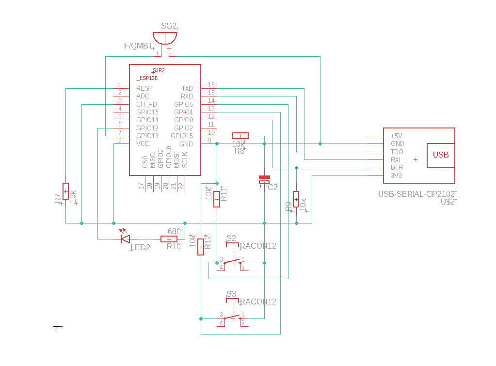

# Obsah
📦MP_NETIO_BUTTON  
 ┣ 📂Code  
 ┃ ┣ 📂ESP8266  
 ┃ ┃ ┣ 📂ESP8266_BUTTON - **ESP Vypínání přes enable**   
 ┃ ┃ ┣ 📂ESP8266_DEEP_SLEEP - **ESP statický program pro DEEP SLEEP**  
 ┃ ┃ ┗ 📂ESP8266_ON - **WEBSERVER a ESP neustále zapnuté**   
 ┃ ┗ 📂ESP32    
 ┃ ┃ ┣ 📂ESP32_BUTTON - **ESP Vypínání přes enable**   
 ┃ ┃ ┣ 📂ESP32_DEEP_SLEEP - **ESP statický program pro DEEP SLEEP**  
 ┃ ┃ ┗ 📂ESP32_ON - **WEBSERVER a ESP neustále zapnuté**   
 ┣ 📂Dokumentace - **Dokumentace pro latex**  
 ┃ ┣ 📂images   
 ┃ ┣ 📜document.pdf   
 ┃ ┗ 📜document.tex  
 ┣ 📂Mereni - **Waveform a screenshoty**    
 ┃ ┣ 📂ESP32  
 ┃ ┗ 📂ESP8266  
 ┣ 📂Navrh vzorku - **Eagle**    
 ┃ ┣ 📂ESP32  
 ┃ ┗ 📂ESP8266  
 ┣ 📂Images   
 ┣ 📜.gitignore  
 ┗ 📜README.md  
# Návod pro sestavení verze ESP8266_ON
- K sestavení je možné použít ESP-07, ESP-12 či dokonce NODEMCU ESP 8266
	- u verze NODEMCU je nutné předefinovat piny Button, Buzzer a LED
		- doporučeno na **BUILTIN LED (GPIO 2)** a **FLASH button (GPIO 0)**
## Zapojení ESP-12

## Arduino IDE
- Pro nahrání programu, musíme stáhnout knihovnu pro **ESP** - http://arduino.esp8266.com/stable/package_esp8266com_index.json
	- Tento odkaz vložíme do *Soubor(Lišta) - Vlastnosti - Správce desek*
	- Po nahrání odkazu přejdeme do *Nástroje - Vývojová deska:# - Manažér desek* a najdeme *esp8266*
	- nainstalujeme *esp8266 by ESP8266 community*
	- Dále v *Nástroje - Vývojová deska:#* najdeme ESP8266 NODEMCU
	- Nastavíme port, na který jsme připojili ESP
	- Nakonec nahrajeme soubor
## Nastavení ovladače
- Po zapnutí ESP8266 se vytvoří WiFi **NETIO_BUTTON**, na kterou se připojíme
- Otevřeme prohlížeč a do url zadáme **192.168.4.1**
	- Toto nás připojí na webserver
- Po připojení vybereme WiFi, na které chceme ovládat Netio Zásuvku
- Jakmile se připojíme, vrátíme se na tlačítkem *NETIO IP* se přeneseme na stránku, kde zadáme IP netio produktu
- Poté tlačítkem *Button Config* zadáme **JSON**, který chceme posílat zásuvce po stisku hardwarového tlačítka

# Zadání maturitní práce
**Splněné tučně**
- V dokumentaci popište technologie NETIO, ESP8266 a ESP32 s ohledem na požadované funkce ovladače
- **Navrhněte vhodné uživatelsky přívětivé rozhraní pro konfiguraci ovladače a jeho
připojení do WiFi sítě**
- **Realizujte požadované funkce na ovladač:**
	- **vstup na 2 nezávislá tlačítka pro standardní dvojitý přepínač/spínač dvou samostatných zásuvek jednoho zařízení NETIO, eliminace rychlých mačkání (nervózní uživatel)**
	- **nepodařený příkaz/přepnutí vypínače (nepodaří se odeslat příkaz http) je indikován bliknutím LED a pípnutím buzzeru. Kontroluje se odpověď http serveru (např. 200, 404 návratové hodnoty)**
	- Zvolte vhodnou technologii výroby funkčních vzorků (nepájivé pole, DPS) a vyrobte jeden funkční vzorek na bázi ESP8266 a druhý na bázi ESP32 s možností měření odebíraného proudu
	- Určete vhodnou metodu měření dynamické spotřeby energie v čase (reakční doby) pro různé režimy připojení, způsobu komunikace a platformy procesoru:
		- **ESP je vypnuto a vzbudí se nějakým externím obvodem přes enable/reset vstup po stisku tlačítka**
		- **ESP je v deep sleep módu - low power režimu a vzbudí se tlačítkem**
 		- **ESP je kontinuálně zapnuto**
		- **Kolik energie spotřebují uvedené režimy při napájení z baterie. Výsledky měření názorně porovnejte**
	- Celou dokumentaci včetně výpisů zdrojového programu s komentářem veďte ve verzovacím systému Git a elektronicky doložte k tištěné podobě dokumentace
## Kritéria funkčnosti
- vyrobené vzorky ovladače (ESP8266 a ESP32) jsou funkční
- **je vytvořeno uživatelské rozhraní pro konfiguraci ovladač**
- **bylo provedeno měření spotřeby a doby odezvy** pro oba typy ovladače

## Výstupy
- srovnání platforem ESP32 a ESP8266 s ohledem na požadované funkce
- návrh požadovaných funkcí ovladače
- **návrh variant ovladače s platformou** ESP32 a **ESP8266** ve formě ověření konceptu
- **zdrojové kódy v repozitáři GIT (GitHub nebo GitLab)**
- **schéma zapojeni všech zkoušených variant v řešení**
- srovnání spotřeby a reakční doby funkčních vzorků
